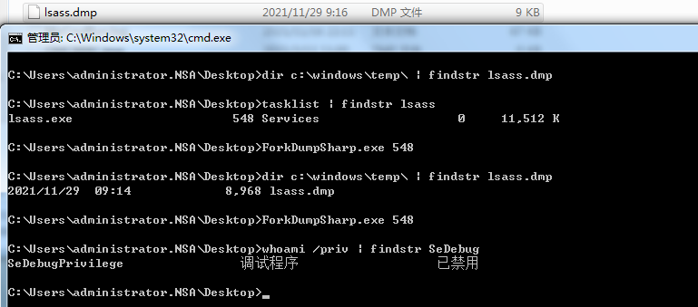
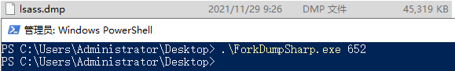

# ForkDumpSharp

* 原文: https://billdemirkapi.me/abusing-windows-implementation-of-fork-for-stealthy-memory-operations/
* C/C++版 POC: https://github.com/D4stiny/ForkPlayground
* Nim版 https://twitter.com/byt3bl33d3r/status/1465108685584142338

没有开启SeDebugPrivilege时 Dump出来的文件只有10k左右

开启权限时

